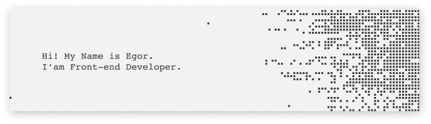

 

💻 &nbsp;I have successfully completed courses from [Yandex Praktikum](https://practicum.yandex.ru/) and [IT-Incubator](https://it-incubator.io/).\
🎓&nbsp;I graduated from the [Russian University of Transport Russia](https://www.miit.ru/), Moscow (Bachelor, class of 2021).\
🌱 &nbsp;I'm going to learn more about front-end and back-end development.\
🏓 &nbsp;In my free time I play guitar, football and calisthenics.\
👯 &nbsp;I’m looking to collaborate on projects that are using React or Next.js.

<h3 align="center"> Social Media: </h3>
  

    
    
    
  

<h3 align="center"> Technologies: </h3>

 

⚡️ GitHub Profile Stat

 

  
  

